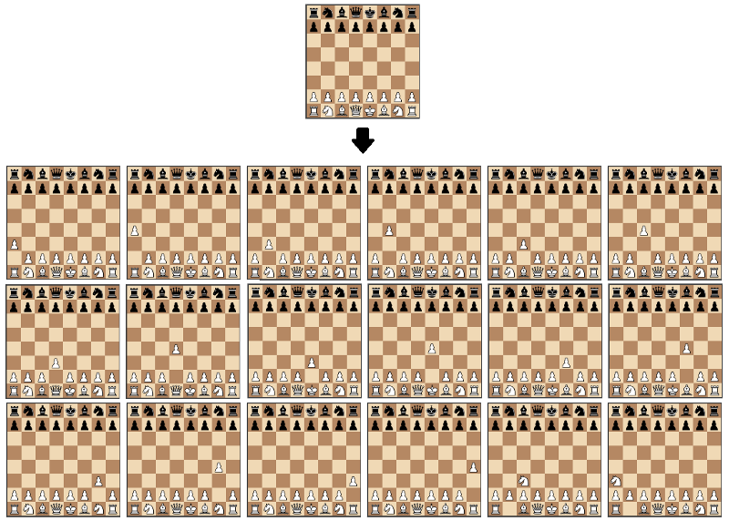

# chess-engine

A pure Rust, dependency-free chess engine built to run anywhere.

## Why write a Chess engine?

I love chess a _lot_. It's definitely one of my favorite games ever. However, I've always been disappointed when trying to play chess digitally. Although wonderful websites like [chess.com](https://chess.com/) and [lichess](https://lichess.org/) exist, it's near impossible to find something that runs on everything.

chess-engine is a solution to my problem. If you want a chess engine that runs on embedded devices, the terminal, [the desktop (with a gui)](https://github.com/DARKEMPIRESL/chess-engine/tree/main/examples/chess-gui), _and_ [the web](https://DARKEMPIRESL.github.io/chess-engine/docs/book/index.html#average-ai), this is probably your best bet.

## How does it work?

This particular AI works using the [Minimax algorithm](https://en.wikipedia.org/wiki/Minimax), along with [Alpha-Beta pruning](https://en.wikipedia.org/wiki/Alpha%E2%80%93beta_pruning) for optimization.

Now, let's unpack that.

The Minimax algorithm essentially iterates through all possible moves recursively, and assumes that whenever the computer plays, the human player will always respond with the best move.

This allows the computer to almost always play objectively better moves than the player.

As you can see with a little experimentation, it works quite well. 

#### Average AI

##### Keep in mind, this is at a low difficulty setting for speed in the browser.

<embed type="text/html" src="https://DARKEMPIRESL.github.io/chess-engine/examples/chess-web/chess-best.html" width="420" height="420"/>

### Abusing Minimax

Because Minimax works by simply maximizing the AI's material advantage over the player, it's incredibly simple to abuse the algorithm by changing what it is maximizing.

Here, for example, is the **_opposite_** of a good AI. This AI tries to maximize _**YOUR**_ material value, and will desperately try to offer you its pieces while still making legal moves.

<embed type="text/html" src="https://DARKEMPIRESL.github.io/chess-engine/examples/chess-web/chess-worst.html" width="420" height="420"/>

## Other features

Additionally, builtin, chess-engine offers an incredibly simple chess variant called [Horde](https://www.chess.com/terms/horde-chess), which I find very fun.

<embed type="text/html" src="https://DARKEMPIRESL.github.io/chess-engine/examples/chess-web/chess-horde.html" width="420" height="420"/>

Additionally, chess-engine supports getting all of the legal moves for a player. So, naturally, I had to add a random-move AI.

<embed type="text/html" src="https://DARKEMPIRESL.github.io/chess-engine/examples/chess-web/chess-random.html" width="420" height="420"/>

